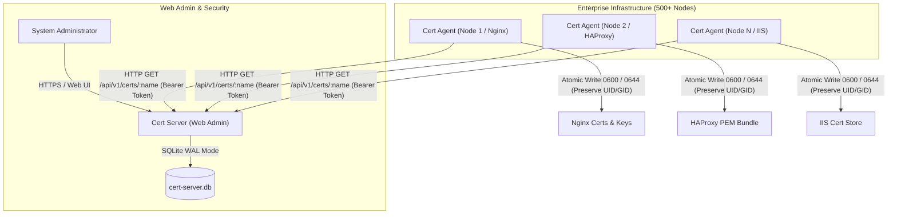

# Cert Deployer - Centralized Certificate Management System

A production-grade, lightweight Certificate Management System built in Go.

## System Architecture

The **Cert Deployer** solution provides automated, secure, and centralized SSL/TLS certificate management and distribution across enterprise networks (bare-metal, VMs, Docker containers, and Kubernetes clusters).



### Component Overview

1. **Cert Server (`/server`)**:
   - **Central Management Vault**: Stores certificate PEM bundles, private keys, SHA256 fingerprints, and expiration dates in a lightweight SQLite database (`cert-server.db`).
   - **High-Concurrency Engine**: Configured with SQLite WAL (Write-Ahead Logging) Mode and 100% Read-Only API Token Authentication. Client sync requests perform pure non-blocking `SELECT` queries, supporting 500+ CCU without database lock contention.
   - **Embedded Management UI**: Single-binary deployment containing an embedded Tailwind CSS Web Admin UI for certificate uploading, manual CRT/KEY downloading, password management, and API token generation.
   - **Cross-Platform Host Runtime**: Native Windows SCM Service integration (`sc.exe`), Linux `systemd` unit files, multi-stage Docker container (`~15MB`), and Kubernetes manifests (`deploy/k8s/`).

2. **Cert Agent (`/client`)**:
   - **Target Node Synchronization**: Independent Go CLI executable installed on target web servers (Nginx, HAProxy, Apache, IIS, etc.).
   - **Smart Check & Sync Workflow**:
     - Computes local certificate SHA256 fingerprints and compares them against the Cert Server metadata before downloading. Skips download if local files are already up-to-date.
     - Performs **Atomic Writes** using temporary files and atomic `os.Rename` operations to prevent web server downtime or corrupted certificate reads.
     - Automatically inspects and **preserves existing file permissions (Chmod) and ownership (UID/GID)** on Linux/Unix systems so non-root processes (`nginx`, `haproxy`) retain read access.
     - Enforces strict `0600` permissions on new private keys and `0644` on public certificates.
   - **Lifecycle Command Execution**: Executes configurable pre-sync (`global_pre_cmd`, `pre_cmd`) and post-sync (`post_cmd`, `global_post_cmd`) commands/scripts (supporting `.sh`, `.bat`, `.cmd`, `.ps1`, and inline shell pipelines) to validate configs (`nginx -t`) and gracefully reload web servers (`systemctl reload nginx`).

---

## 1. Cert Server (`/server`)

### Features
- Embedded Web Admin UI (built with Go `embed.FS` and Tailwind CSS).
- SQLite Database storing certificate PEM contents, public key fingerprints (SHA256), and expiration dates (`not_after`).
- Automatic X.509 certificate parsing and public/private key cryptographic consistency check prior to saving.
- Download Cert (`.crt`) and Download Key (`.key`) buttons directly from the Web UI modal.
- API Bearer Token generation and revocation with 1-click Copy Token button.
- Clean 1-Token Card UI View & 100% Read-Only Token Authentication for high CCU performance.
- Change Admin Password & Configurable HTTP Management Port via Web UI Settings Modal.
- REST API protected by Bearer Token Authorization.
- Native Windows Service support (via Windows SCM) with automatic error logging to `cert-server.log`.

### Build & Run (Bare Metal / VM)
```bash
cd server
go build -o cert-server main.go
./cert-server
```
By default, the server runs on `http://localhost:8080` (Default credentials: Username `admin`, Password `admin123`).

Environment variables:
- `PORT`: HTTP listener port (default `8080` or configured via Web UI Settings).
- `DB_PATH`: SQLite database file path (default `data/cert-server.db` or `cert-server.db`).

---

## 2. Docker & Kubernetes Deployment (Cert Server)

### A. Docker Compose Deployment (1-Command Run)
Run the server using Docker Compose with volume persistence at `/app/data`:
```bash
docker-compose up -d --build
```
This builds the multi-stage `server/Dockerfile` (~15MB image) and mounts persistent database storage to named volume `cert-server-data`.

### B. Kubernetes Deployment (K8s)
All Kubernetes manifests are provided under [`deploy/k8s/`](file:///C:/Users/Administrator/Desktop/cert-rotate-tool/deploy/k8s):

1. **Apply PVC (PersistentVolumeClaim)**:
   ```bash
   kubectl apply -f deploy/k8s/pvc.yaml
   ```
2. **Apply Deployment**:
   ```bash
   kubectl apply -f deploy/k8s/deployment.yaml
   ```
3. **Apply ClusterIP Service**:
   ```bash
   kubectl apply -f deploy/k8s/service.yaml
   ```
4. **Apply Ingress**:
   ```bash
   kubectl apply -f deploy/k8s/ingress.yaml
   ```

---

## 3. Cert Agent Component (`/client`)

### Features
- CLI Commands: `cert-agent check` and `cert-agent sync`.
- Auto-detects `./config.yaml` in the current working directory if `-c` is omitted.
- Supports both Linux (`sh -c`) and Windows (`cmd /c`) shell command and script file execution.
- Global commands (`global_pre_cmd`, `global_post_cmd`) and per-certificate commands (`pre_cmd`, `post_cmd`).
- Robust Windows path preprocessing: supports natural single backslashes `\` (`"D:\tmp\1 1\expired.pem"`) without YAML escape errors.
- Automatic backup of existing cert/key files before overwriting (saves copy in the same directory as `<filename>.<DDMMYYYY>.bak` preserving mode/owner).
- Atomic file writes using temporary files and atomic `os.Rename`.
- Preserves existing file permissions (Mode) and ownership (UID/GID on Linux/Unix).
- Strict file permission `0600` fallback for new private key files (`0644` for public certs).
- Checks local file existence: skips syncing if local `certfile` or `keyfile` does not exist.
- Native PKCS#12 (`.pfx`) generation in pure Go (triggered automatically by configuring `pfxfile` in `config.yaml`).
- Automatic Windows Certificate Store (`Cert:\LocalMachine\My`) import and IIS Web Site HTTPS rebinding (`iis_site_name`, `iis_binding_host`).
- Automatic parent directory creation (`os.MkdirAll`) for missing target certificate paths.
- Special handling for combined cert files (e.g. HAProxy where `certfile == keyfile`).

### Build

Using automated build scripts (compiled for both Windows & Linux):
```cmd
:: On Windows
.\build.bat
```
```bash
# On Linux
./build.sh
```

---

## 4. Native System Services Setup & Management

### A. Windows Service Setup & Removal (Native `sc.exe`)
No third-party tools required. Uses Windows native `sc.exe`:

- **Install & Start Service**: Run `scripts/service_install_windows.bat` as Administrator:
  ```cmd
  scripts\service_install_windows.bat
  ```
- **Stop & Uninstall Service**: Run `scripts/service_uninstall_windows.bat` as Administrator:
  ```cmd
  scripts\service_uninstall_windows.bat
  ```

### B. Linux Service Setup & Removal (Native Systemd)
Run automated Linux service management scripts as root:

- **Install & Start Services**:
  ```bash
  sudo ./scripts/service_install_linux.sh
  ```
- **Stop & Uninstall Services**:
  ```bash
  sudo ./scripts/service_uninstall_linux.sh
  ```

---

## 5. Configuration Guide (`config.yaml`)

```yaml
server_url: "http://localhost:8080"
auth_token: "secret-bearer-token-here"

global_pre_cmd: "echo 'Starting cert sync session...'"

certs:
  - servercert_name: "prod_web_cert"
    certfile: "D:\vnshell\it\Linux\prod_web.crt"
    keyfile: "D:\vnshell\it\Linux\prod_web.key"
    pre_cmd: "nginx -t"
    post_cmd: "systemctl reload nginx"

global_post_cmd: "echo 'Cert sync session completed successfully!'"
```

### Script & Command Declaration Examples

#### Windows (`cmd.exe`)

1. **Standard `.bat` / `.cmd` Script**:
   ```yaml
   global_pre_cmd: "C:\scripts\pre_check.bat"
   # Or unquoted:
   global_pre_cmd: C:\scripts\pre_check.bat
   ```

2. **Script Path with Spaces**:
   ```yaml
   global_pre_cmd: '"C:\My Scripts\pre_check.bat"'
   ```

3. **PowerShell Script (`.ps1`)**:
   ```yaml
   global_pre_cmd: "powershell -ExecutionPolicy Bypass -File C:\scripts\pre_check.ps1"
   ```

4. **Script with Arguments**:
   ```yaml
   global_pre_cmd: "C:\scripts\pre_check.bat --env prod --port 8080"
   ```

5. **Inline Commands**:
   ```yaml
   global_pre_cmd: "copy nul c:\global_precmd.txt"
   ```

---

#### Linux (`sh`)

1. **Shell Script (`.sh`)**:
   ```yaml
   global_pre_cmd: "/usr/local/bin/pre_check.sh"
   # Or via bash:
   global_pre_cmd: "bash /etc/cert-agent/scripts/pre_check.sh"
   ```

2. **Script with Arguments**:
   ```yaml
   global_pre_cmd: "/usr/local/bin/pre_check.sh --check-all"
   ```

3. **Inline Commands**:
   ```yaml
   global_pre_cmd: "nginx -t && systemctl reload nginx"
   ```
